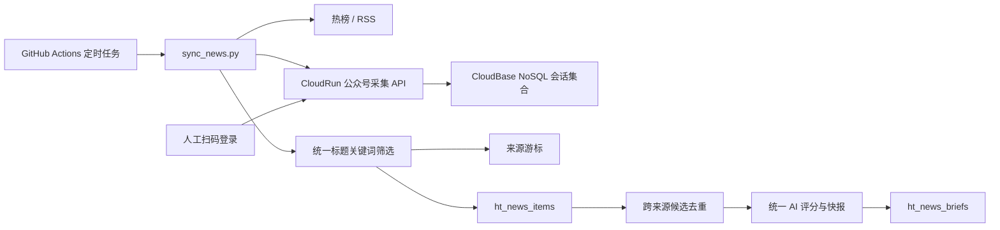

# 公众号新闻接入技术方案

## 1. 方案概述

本方案由两个本地仓库共同完成：

- `wechat-article-exporter-cloudbase`：基于开源 `wechat-article-exporter` 的 CloudBase CloudRun 适配版，负责扫码登录、会话保存、公众号搜索和文章列表代理。
- `华泰互联网组数据门户`：现有新闻同步系统，负责白名单、标题关键词筛选、游标、CloudBase 新闻入库、跨来源去重、AI 评分和增量快报。

调度继续使用现有 GitHub Actions。CloudRun 不运行后台定时线程，不新增云函数。



## 2. CloudRun 服务设计

### 2.1 部署形态

- 模式：CloudBase CloudRun 容器模式。
- 源码：`D:\mine\finance\华泰证券\wechat-article-exporter-cloudbase`。
- 运行时：项目原生 Node.js 22 + Nuxt/Nitro。
- 端口：应用读取 CloudRun 注入的 `PORT`；Dockerfile 不依赖固定外部端口。
- 公网：开启 `WEB`，供人工扫码页面和 GitHub Actions 调用。
- 建议资源：1 vCPU / 2 GiB，最小实例 1，最大实例 2。
- 服务名：`wechat-article-exporter`。

### 2.2 会话持久化

原项目的本地文件 KV 和容器内存不能作为 CloudRun 的可靠会话存储。新增 CloudBase 文档数据库会话仓库，使用 `@cloudbase/node-sdk` 和 CloudRun 环境身份访问，避免给应用额外注入数据库管理密钥：

```text
wechat_exporter_sessions/{authKey}
  token
  cookies
  createdAt
  updatedAt
  invalidAt?
  invalidReason?

wechat_exporter_state/current-session
  authKey
  updatedAt
```

行为：

- 登录成功时继续生成短期 `auth_key`。
- 会话 Cookie 和微信 token 写入 `wechat_exporter_sessions`。
- 当 `COLLECTOR_AUTO_BIND_SESSION=true` 时，登录成功自动把 `wechat_exporter_state/current-session` 指向新会话。
- 微信上游认证结果是实际有效性的权威来源；遇到认证失效时标记会话无效，不依赖容器本地 TTL 判断。
- 重新扫码仅更新服务端状态；GitHub Secrets 不变化。
- 无 CloudBase 数据库配置的本地开发环境继续回退到原 Nitro KV。

### 2.3 内部采集 API

所有内部接口使用：

```http
Authorization: Bearer <WECHAT_COLLECTOR_API_KEY>
```

接口：

| 方法 | 路径 | 用途 |
| --- | --- | --- |
| GET | `/api/health` | 服务存活检查，不返回敏感数据 |
| GET | `/api/internal/v1/collector/status` | 返回存储和当前会话状态 |
| POST | `/api/internal/v1/collector/accounts/resolve` | 批量搜索白名单公众号，供首次解析 `fakeid` |
| GET | `/api/internal/v1/collector/accounts/:fakeid/articles?begin=0&size=20` | 使用当前采集会话读取文章列表 |

内部接口不返回微信 Cookie、token 或当前 `auth_key`。

### 2.4 安全要求

- `WECHAT_COLLECTOR_API_KEY` 仅通过 CloudRun 环境变量注入；CloudBase SDK 使用环境身份和 `CLOUDBASE_ENV_ID`。
- Bearer token 使用常量时间比较。
- 参数限制：`size <= 20`、`begin >= 0`、关键词长度限制。
- 内部接口错误只返回稳定错误码，不回显 Cookie、token 或完整上游响应。
- 两个会话集合设置为 `ADMINONLY`，不开放前端直接读取权限。

## 3. 新闻流水线设计

### 3.1 配置

在 `config/news-sources.json` 增加：

```json
{
  "wechat": {
    "enabled": true,
    "pageSize": 20,
    "maxPagesPerAccount": 3,
    "requestIntervalMs": 500,
    "accounts": [
      {"name": "新智元", "fakeid": "", "enabled": true},
      {"name": "Z Finance", "fakeid": "", "enabled": true},
      {"name": "财联社AI Daily", "fakeid": "", "enabled": true},
      {"name": "财联社", "fakeid": "", "enabled": true},
      {"name": "云头条", "fakeid": "", "enabled": true},
      {"name": "智东西", "fakeid": "", "enabled": true},
      {"name": "36氪", "fakeid": "", "enabled": true}
    ]
  }
}
```

运行环境：

- `WECHAT_EXPORTER_BASE_URL`
- `WECHAT_COLLECTOR_API_KEY`

### 3.2 公众号适配器

新增独立 `wechat.py` 来源适配器：

1. 只遍历配置中的启用账号。
2. 缺少 `fakeid` 时记录可操作问题并跳过，不自动选择搜索结果第一项。
3. 每账号从 `begin=0` 开始读取，遇到已保存游标或回看窗口之前的文章停止。
4. 单账号最多读取 `maxPagesPerAccount` 页，每页最多 20 条。
5. 仅对标题调用现有 `classify(title, config)`。
6. 摘要使用公众号文章 `digest`，保留给 AI，但不用于关键词准入。
7. 映射为现有新闻字段，`source_type=公众号`、`source_id=wechat:<fakeid>`。
8. 单账号失败只追加 issues，不中断其他账号、热榜、RSS 或 AI 流程。

### 3.3 公众号绑定与来源游标

新增表，以配置中的稳定账号 ID 为主键，同时保存确认后的 `fakeid` 和运行游标：

```sql
CREATE TABLE ht_news_wechat_accounts (
  id VARCHAR(80) PRIMARY KEY,
  _openid VARCHAR(64) DEFAULT '' NOT NULL,
  display_name VARCHAR(160) NOT NULL,
  fakeid VARCHAR(120) NULL,
  enabled TINYINT(1) DEFAULT 1,
  cursor_aid VARCHAR(120) NULL,
  cursor_published_at DATETIME NULL,
  last_success_at DATETIME NULL,
  last_error TEXT,
  created_at DATETIME DEFAULT CURRENT_TIMESTAMP,
  updated_at DATETIME DEFAULT CURRENT_TIMESTAMP ON UPDATE CURRENT_TIMESTAMP,
  INDEX idx_ht_news_wechat_fakeid (fakeid),
  INDEX idx_ht_news_wechat_enabled (enabled)
);
```

成功完成账号抓取后才更新游标。账号抓取失败时保留旧游标，便于下次补偿。

为保持公众号文章身份稳定并记录删除/封禁状态，对现有表执行向后兼容的增量字段扩展：

- `ht_news_items.external_id`：公众号 `aid`。
- `ht_news_items.source_status`：正常、已删除、封禁等来源状态。
- `ht_news_sync_runs.status`：本轮运行状态。
- `ht_news_sync_runs.metrics_json`：公众号和总体运行指标。

### 3.4 跨来源候选去重

在 AI 候选池构造前执行轻量近似去重：

- 标题标准化后完全一致：合并。
- 标题互相包含且长度比例合理：合并。
- `difflib.SequenceMatcher` 相似度达到阈值：合并。
- 主记录保留最新时间与最高已有分数，并记录 `relatedSources`、`relatedIds`。
- 新闻明细表仍保留原始来源记录；仅 AI 快报候选去重。

### 3.5 GitHub Actions

继续在现有 `pages.yml` 的 `Generate news data` 步骤运行一次 `python tools/sync_news.py`，增加两个 Secrets：

- `WECHAT_EXPORTER_BASE_URL`
- `WECHAT_COLLECTOR_API_KEY`

同一进程完成所有来源抓取、合并、入库和一次 AI 快报生成。

## 4. 错误处理与可观测性

- issues 中增加来源、账号、错误类型和可恢复建议。
- 运行结果增加 `wechatAccounts`、`wechatFetched`、`wechatMatched`。
- 登录态失效返回稳定错误码 `WECHAT_SESSION_EXPIRED`，同步日志明确提示重新扫码。
- 本期不接入额外消息告警。

## 5. 测试策略

### 5.1 CloudRun 服务

- Nuxt 生产构建通过。
- 会话仓库的本地 KV 回退测试。
- 内部 API 鉴权、参数校验、会话缺失/过期测试。
- 登录成功自动绑定当前采集会话测试。
- Dockerfile 构建检查；条件允许时运行容器健康检查。

### 5.2 新闻流水线

- 白名单和缺失 `fakeid` 测试。
- 公众号分页、游标停止、失败隔离测试。
- 标题命中、摘要命中但标题不命中的口径测试。
- 公众号字段映射与稳定 ID 测试。
- 游标读写测试。
- 跨来源近似去重测试。
- 完整同步编排测试。

## 6. 部署验证

1. 通过 CloudBase MCP 登录并绑定目标环境。
2. 查询现有文档数据库集合和 MySQL 表。
3. 创建两个会话集合、一个来源游标表并检查安全规则。
4. 部署 CloudRun 容器并查询服务详情。
5. 验证健康接口。
6. 人工扫码登录。
7. 验证 session 接口有效。
8. 搜索 7 个公众号并确认 `fakeid`。
9. 更新白名单配置。
10. 本地或手动触发一次同步，验证公众号入库、AI 评分和快报。

## 7. 兼容与回滚

- 未配置公众号环境变量时，公众号适配器只记录“未启用/未配置”，原有热榜与 RSS 行为不变。
- CloudRun 服务异常时，新闻同步继续处理其他来源。
- 新表均为增量新增，不修改现有新闻表字段。
- 可通过 `wechat.enabled=false` 一键停用公众号来源。
